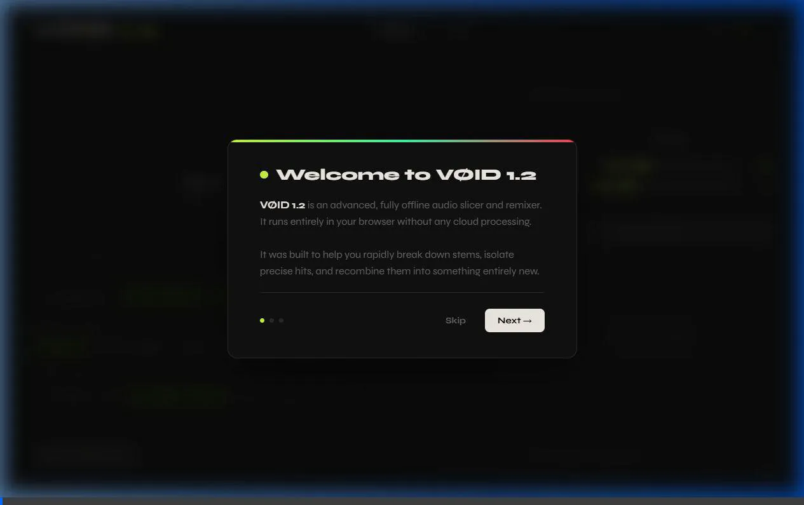

# VØID 1.2 🔪🎶

**Slice and dice.** The hyper-fast offline audio slicer and algorithmic remixer.



## What is VØID 1.2?

VØID 1.2 isn't just a sampler; it’s a creative engine built for speed. It allows you to drag in your audio files, slice them instantly without any cloud processing (zero-latency), and instantly manipulate them. From precise sample chopping to algorithmic remixing, it provides the fastest path from a raw sample to a ready-to-use DAW instrument.

Available as both a **standalone web application** and a **portable Windows executable (.exe)**. No accounts. No uploads. Fully offline.

---

## ⚡ Breakdown of Features

### 1. Zero-Latency Offline Slicing
Everything happens locally on your machine. Drag in a 2-minute song or a folder of sounds, and VØID processes it instantly without sending your data to a cloud server. 

### 2. Granular Slice Modes
Take control of how your audio is chopped:
* **Phrase / Measure:** Perfect for looping and structured sampling.
* **Triplets / Subdivisions:** Cut by 1/4 triplets and more for rhythmic variations.
* **Transient Isolation:** Automatically detect and slice at audio peaks (perfect for isolating drum hits and percussion).

### 3. Algorithmic Local Remixer
Let the algorithm build a new arrangement for you. VØID includes built-in generative engines to auto-remix your slices:
* **Markov Chains:** Predicts and generates sequences based on sample probability.
* **Euclidean Stutter:** Generates mathematically spaced polyrhythms and stutters.
* **Golden Ratio Builds:** Arranges samples organically based on the golden ratio sequence.

### 4. Playable Pad Bank (16-Pad Sampler)
Once sliced, drag and drop your favorite chops onto a 16-pad grid. Map them to your MIDI or computer keyboard and start finger-drumming and performing immediately.

### 5. Sample Refinement Engine
Don't just slice—sculpt. Click on any slice to trim its start/end points, micro-edit, and rename it directly within the app before exporting.

### 6. 1-Click Ableton Drum Rack Export
The ultimate workflow hack. Once your pad bank is loaded up and refined, click **"Export Ableton Drum Rack"**. VØID bundles your processed samples and an `.adg` file that you can drag straight into Ableton Live. 

---

## 🚀 Getting Started

VØID 1.2 gives you two ways to play:

### 1. Portable Desktop App (.exe)
VØID comes as a fully self-contained Electron app for Windows. 
* No installation required.
* Simply run `VOID_1.2_Portable.exe` to launch the standalone desktop experience.
* Perfect for a dedicated studio workflow.

**To build from source:**
```bash
npm install
npm run build
```

### 2. Standalone Web App
Prefer the browser? You can run VØID seamlessly in any modern web browser.
* Open `index.html` located in the `Standalone_Web_App` folder.
* Drag and drop your audio files into the interface and start slicing.

---

**Tags:** `#AudioSlicer` `#Remixer` `#WebAudio` `#Ableton` `#Sampling` `#Beatmaking` `#OfflineAudio` `#AlgorithmicMusic` `#ElectronApp`